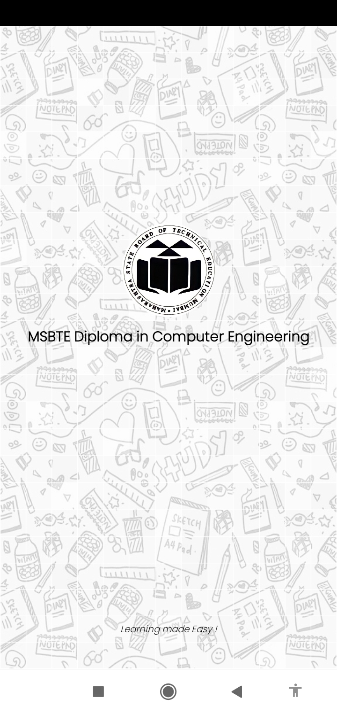
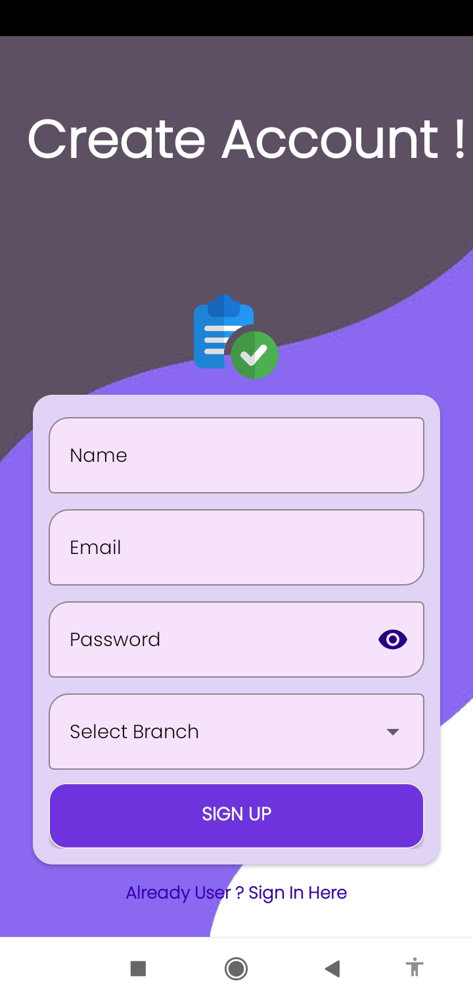
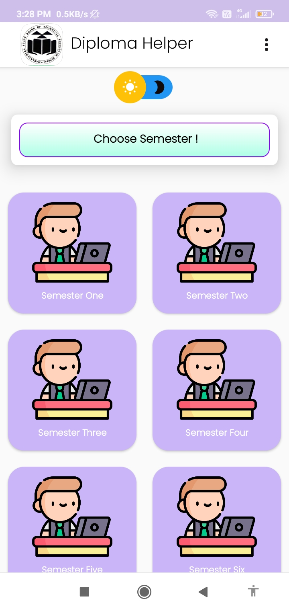
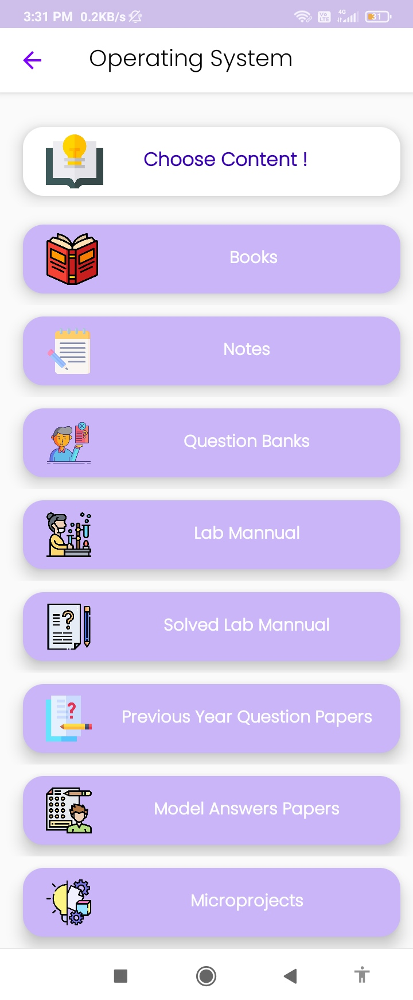
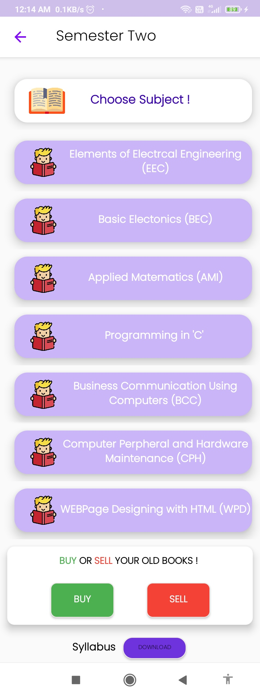
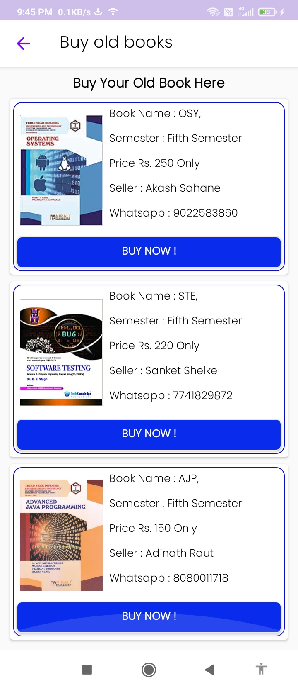
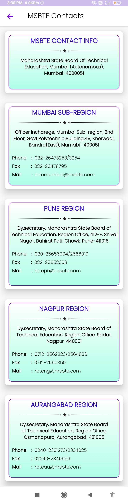
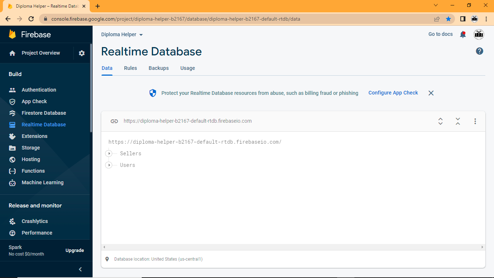
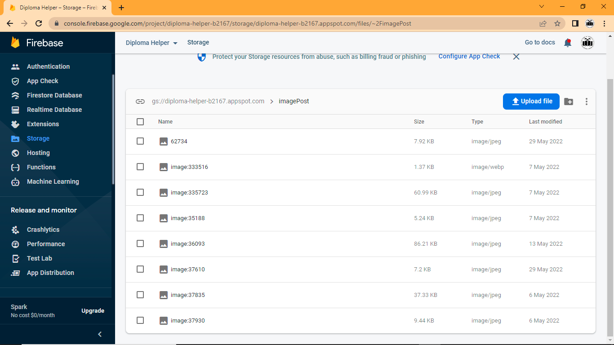
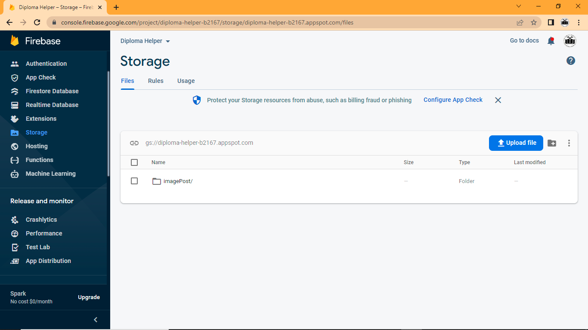

# Diploma Study Companion

## Description
Designed and developed an Android application aimed at providing diploma students with easy access to study resources. The app features a user-friendly interface allowing students to browse and access study materials conveniently. Implemented real-time database functionality using Firebase to ensure seamless synchronization of data across devices. Additionally, integrated Firebase Authentication to provide secure access to the application's features.

## Features
- Register and login functionality
- OTP verification of email
- Profile page in which you can edit your profile

## Technologies Used
- Java
- Android SDK
- Firebase Realtime Database
- Firebase Authentication

## Screenshots

---

Feel free to modify and expand this readme according to your needs.
